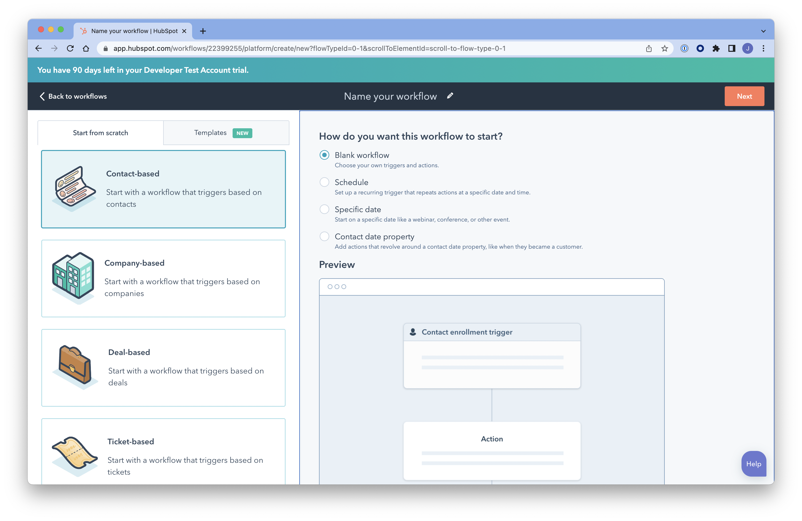
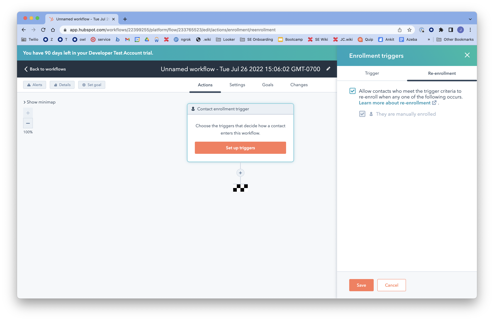
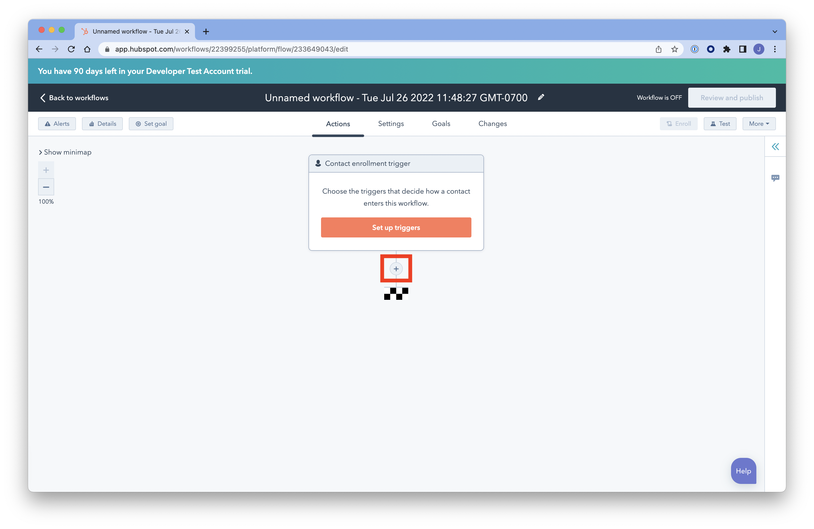
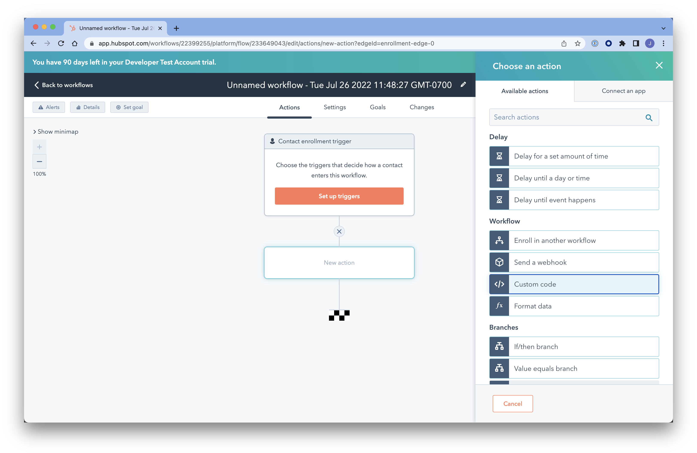
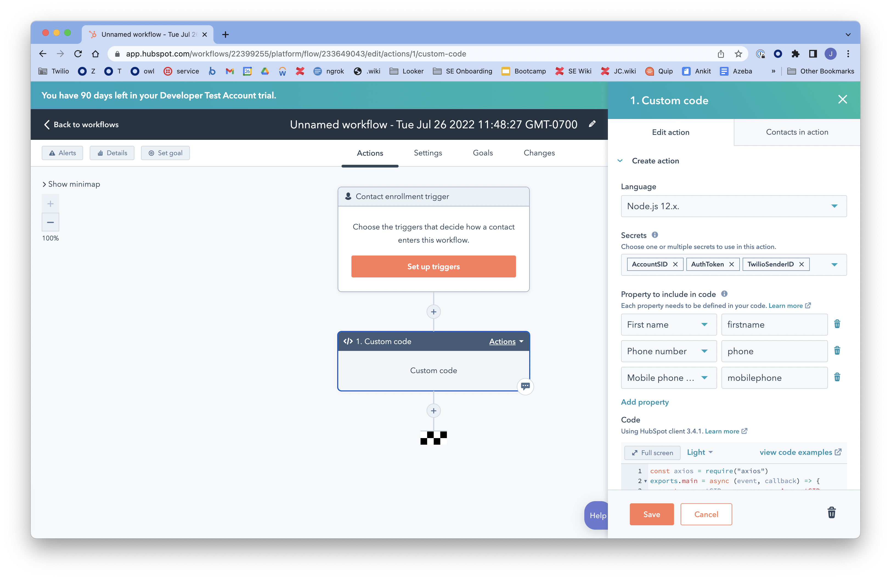
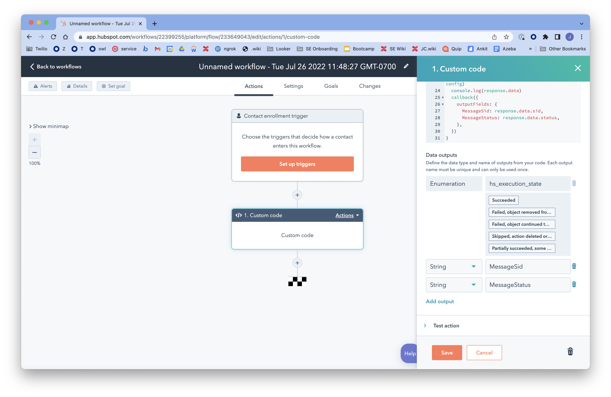
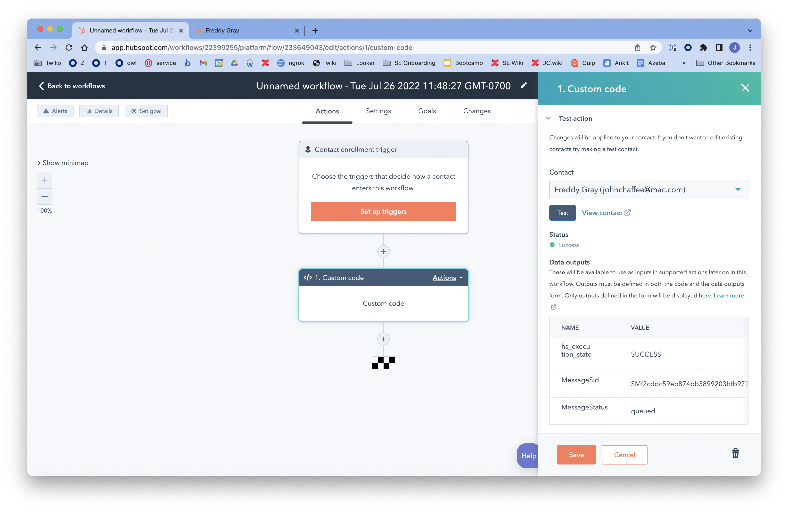
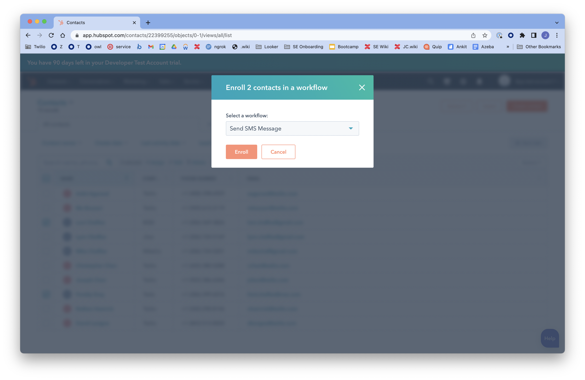

# Twilio Hubspot SMS Workflow

How to send an SMS from Hubspot using an Automation Worklow Custom Code Action.

## Overview

This document describes the steps involved for sending SMS using Twilio Messaging API using Hubspot Workflow Custom Code Actions.

Twilio APIs are easy to use and can be called from any platform capable of sending HTTP Requests. Hubspot enables customers to send HTTP requests using Custom Code Actions within Automation Workflows.

This tutorial will be using [Twilio Messaging APIs to send an SMS](https://www.twilio.com/docs/sms/api/message-resource#create-a-message-resource).

## Create a Hubspot Workflow

Follow these [Hubpost instruction](https://knowledge.hubspot.com/workflows/create-workflows) to create an automation workflow.

- In your HubSpot account, navigate to Automation > Workflows.
- To create a new workflow, in the upper right, click **Create workflow**.
- On the left, choose Start from scratch > **Contact-based**. On the right, choose **Blank workflow**, then click Next.



- Click on the **Contact enrollment trigger** box, then in the right sidebar click the **Re-enrollment** tab and click the two checkboxe shown below. You can also set an automatic trigger for the action in the Triggers tab but for our purposes we will not set a trigger and will invoke the action manually.



- Click the **+ button** below the Contact enrollment trigger box.



- Click the **Custom code** button in the right sidebar.



In the Custom code sidebar, enter the following:

- For **Language**, select `Node.js 12.x`.
- For **Secrets**, add secrets for the following (you can find these values in the Twilio Console):
  - `AccountSID: <Your Twilio Account SID>`
  - `AuthToken: <Your Twilio Auth Token>`
  - `TwilioSenderID: <Your Twilio Phone Number in E.164 format (e.g. +12065551234)>`
- For **Property to include in code** section, click Add property, then search for and choose the following:
  - First name: `firstname`
  - Phone number: `phone`
  - Mobile phone number: `mobilephone`



- In the **Code** section, copy and paste the following code from the `send-sms.js` file. Note: you may customize the `body` const with your desired message body text.

```js
// Load the axios library for sending HTTP request to the Twilio API
const axios = require("axios")

exports.main = async (event, callback) => {
  // Load environment variables that are stored as Secrets in Hubspot
  // These are required for the Twilio API
  const accountSID = process.env.AccountSID
  const authToken = process.env.AuthToken
  const fromPhoneNumber = process.env.TwilioSenderID

  // Evaluate the contact's mobilePhone and phone fields to determine the toPhoneNumber
  // Use the mobilePhone if it exists, otherwise use phone
  // TODO: This would be a good place to use Lookup to verify the phone is a mobile number
  const phone = event.inputFields["phone"]
  const mobilePhone = event.inputFields["mobilephone"]
  const toPhoneNumber = mobilePhone ? mobilePhone : phone

  // Define the template for the message body. It can include dynamic {{variables}} from fields in Hubspot
  // For each variable, make sure you add the corresponding property to the workflow during setup
  const template =
    "Hi {{firstname}}. This is a Twilio SMS message sent from a Hubspot Automation Workflow."

  // Create message body by replacing the template {{variables}} with the input fields of the same key
  const inputFields = event.inputFields
  const body = template.replace(/{{([^}]+)}}/g, (match, key) => {
    return inputFields[key]
  })

  // Define the axios url, params and config headers
  const url = `https://api.twilio.com/2010-04-01/Accounts/${accountSID}/Messages.json`
  const params = new URLSearchParams()
  params.append("From", fromPhoneNumber)
  params.append("To", toPhoneNumber)
  params.append("Body", body)
  const config = {
    headers: {
      Authorization:
        "Basic " + Buffer.from(`${accountSID}:${authToken}`).toString("base64"),
      "Content-Type": "application/x-www-form-urlencoded",
    },
  }

  // Send API request to Twilio via Axios
  const response = await axios.post(url, params, config)
  callback({
    outputFields: {
      MessageSid: response.data.sid,
      MessageStatus: response.data.status,
    },
  })
}
```

- In the **Data outputs** section, enter the following:
  - String: `MessageSid`
  - String: `MessageStatus`



- Click the **Test action** link, search for and select your contact record (create a contact record for yourself if you haven't already), then click Test. If all goes well, you should see the `MessageSid` and `MessageStatus` displayed in the Data outputs section of the sidebar and you should receive a text message on your phone.



- Name the workflow "Send SMS Message" on the top center of the screen, then click **Save** on the bottom right. Then click the Review and Publish button on the top right.

## Using the Worflow

To invoke the workflow, go to the Contacts screen, check one or more contacts, click **More > Enroll in worklow**, select the **Send SMS Message** workflow and click **Enroll**. All of the checked contacts will receive the text message.

