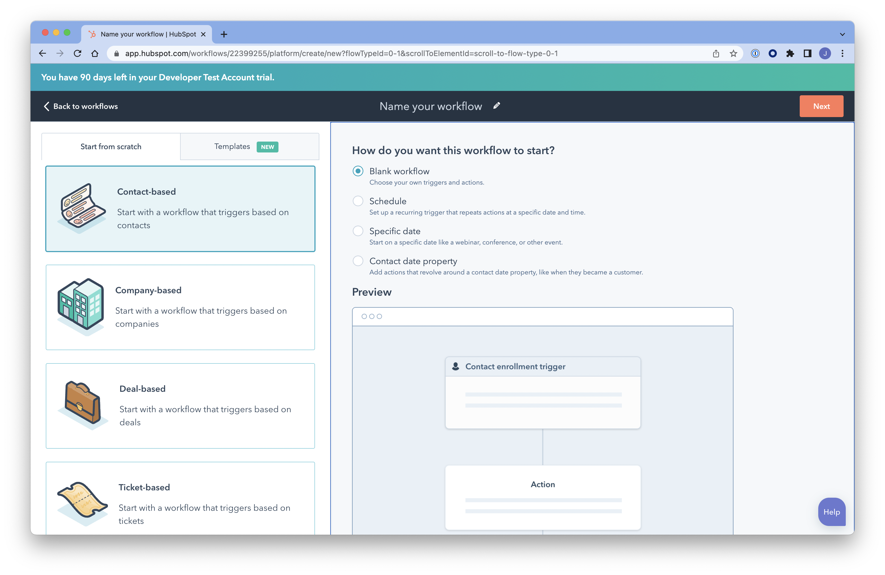
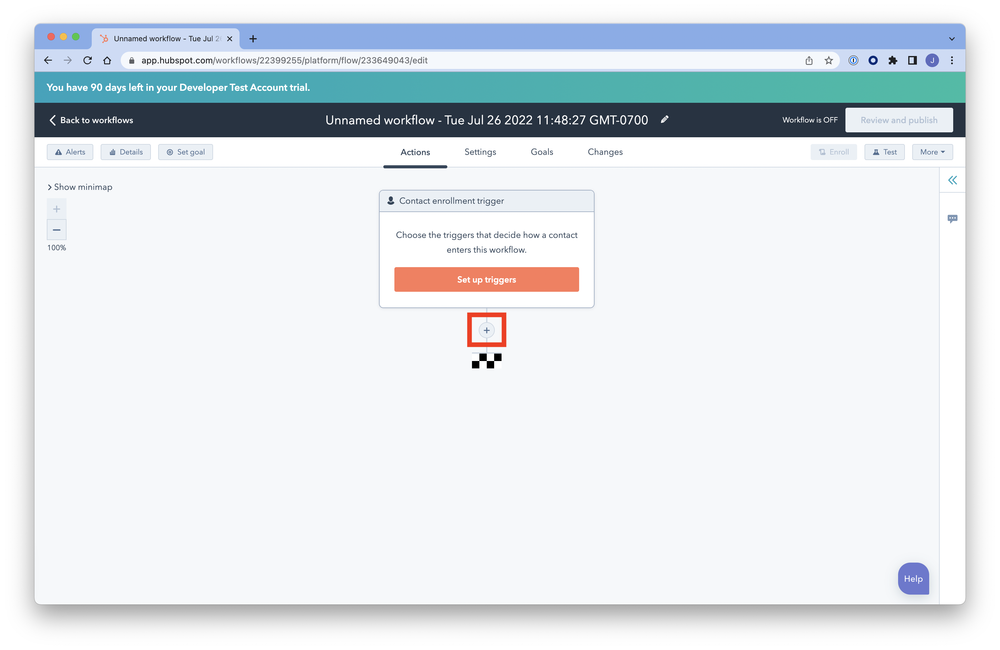
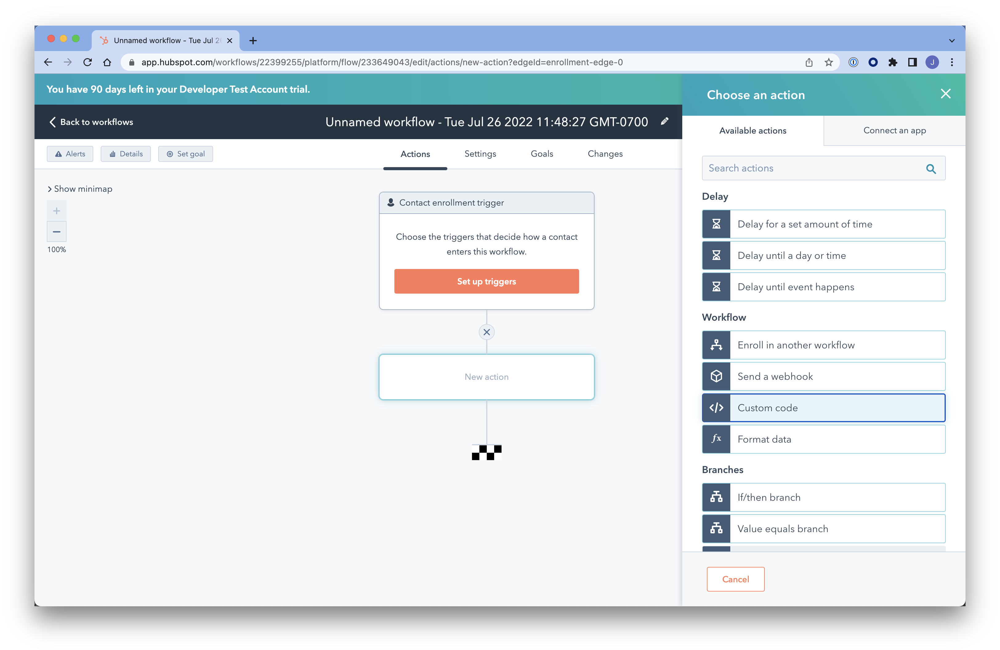
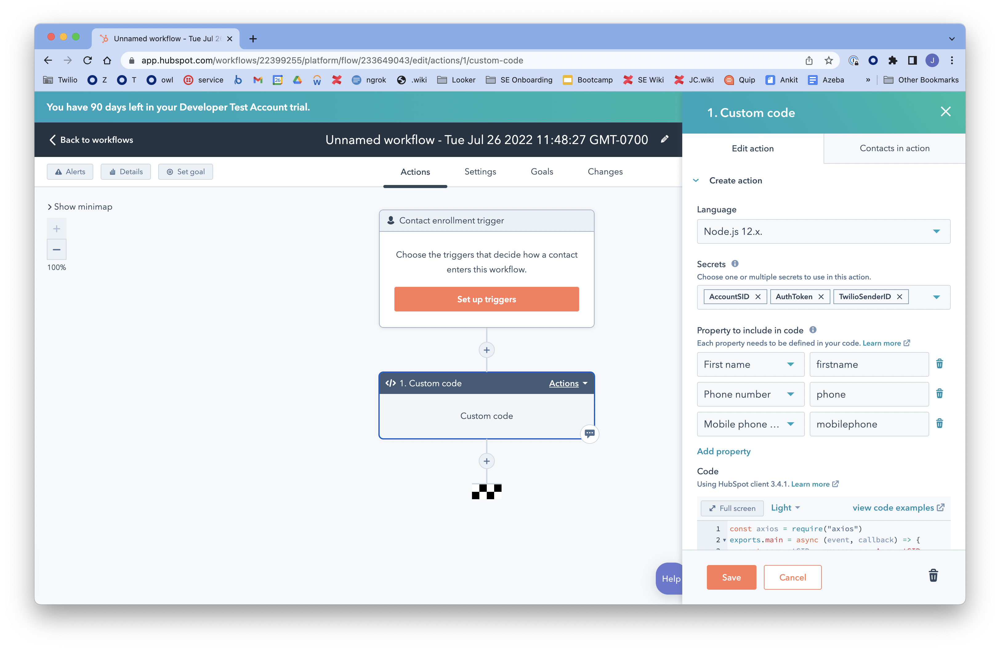
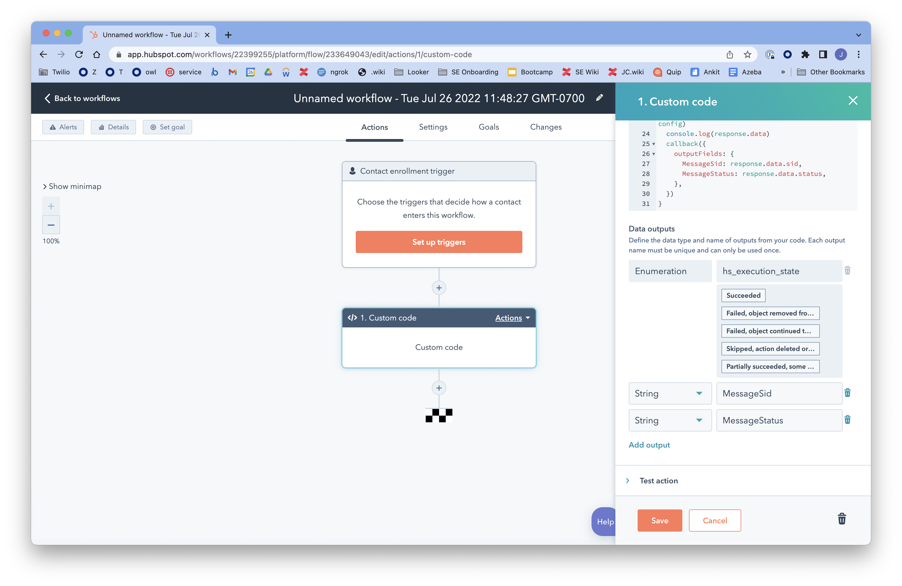

# Twilio Hubspot SMS Workflow

How to send an SMS from Hubspot using an Automation Worklow Custom Code Action.

## Overview
This document describes the steps involved for sending SMS using Twilio Messaging API using Hubspot Workflow Custom Code Actions.

Twilio APIs are easy to use and can be called from any platform capable of sending HTTP Requests. Hubspot enables customers to send HTTP requests using Custom Code Actions within Automation Workflows.

This tutorial will be using [Twilio Messaging APIs to send an SMS](https://www.twilio.com/docs/sms/api/message-resource#create-a-message-resource).

## Create a Hubspot Workflow

Follow these [Hubpost instruction](https://knowledge.hubspot.com/workflows/create-workflows) to create an automation workflow.

- In your HubSpot account, navigate to Automation > Workflows.
- To create a new workflow, in the upper right, click **Create workflow**.
- On the left, choose Start from scratch > **Contact-based**. On the right, choose **Blank workflow**, then click Next.

- You can choose an optional trigger for the action by clicking the Set up triggers button and choosing form a list of triggers on the right. For our purposes, we will not set a trigger, so the action will have to be invoked manually. Click the **+ button** below the Contact enrollment trigger box.

- Click the **Custom code** button in the right sidebar.

In the Custom code sidebar, enter the following:
 - For **Language**, select `Node.js 12.x`.
 - For **Secrets**, add secrets for the following (you can find these values in the Twilio Console):
   - `AccountSID: <Your Twilio Account SID>`
   - `AuthToken: <Your Twilio Auth Token>`
   - `TwilioSenderID: <Your Twilio Phone Number in E.164 format (e.g. +12065551234)>`
 - For **Property to include in code** section, click Add propery, then search for and choose the following:
   - First name: `firstname`
   - Phone number: `phone` (or Mobile phone if you prefer)
   - Mobile phone number: `mobilephone`

- In the **Code** section, click the Full screen button to expand the code editor and paste the code from the `send-sms.js` file. Note: you may customize the `body` const with your desired message body text.

- Click the Exit full screen button, to shrink the code editor, and enter the following **Data outputs**:
  - String: `MessageSid`
  - String: `MessageStatus`

- Click the **Test action** link, search for your contact record, then click Test. If all goes well, you should see the `MessageSid` and `MessageStatus` displayed in the Data outputs section of the sidebar and you should receive a text message on your phone.

